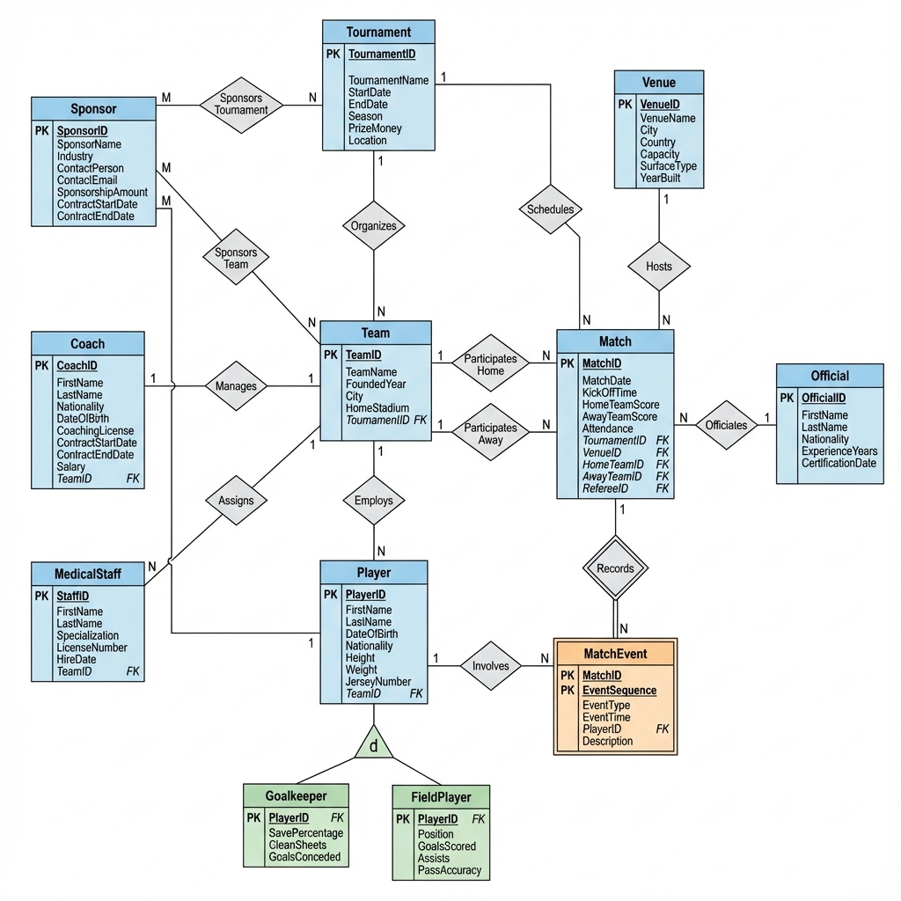

# ICT702 Assessment 2 - Database Design and Implementation
## Football Tournament Management System

**Student Name:** [Your Name]  
**Student ID:** [Your ID]  
**Course:** ICT702 - Introduction to Relational Database  
**Assessment:** Assignment 2 - Individual Assignment  
**Due Date:** Sunday, 7/12/2025 23:59

---

## 1. Case Study

### 1.1 Scenario Description

The **Football Tournament Management System** is designed to manage comprehensive data for professional and amateur football tournaments. This system tracks multiple tournaments, participating teams, players, matches, officials, venues, sponsors, and related activities.

The system manages tournaments organized throughout the year, where teams register and compete. Each team has players with specific positions and performance statistics. Matches are scheduled at various venues (stadiums) with assigned referees and linesmen. The system tracks match events such as goals, assists, yellow cards, and red cards. Sponsors can support tournaments, teams, or individual players. Medical staff are assigned to teams to handle player injuries. Coaches manage teams with specific contract details.

### 1.2 Business Rules

1. **Tournaments** can have multiple teams, but each team participates in one tournament at a time
2. **Teams** consist of multiple players, and each player belongs to one team
3. **Players** can be categorized into specific types: **Goalkeepers**, **Defenders**, **Midfielders**, and **Forwards** (specialization hierarchy)
4. **Matches** involve exactly two teams (home team and away team) and are played at one venue
5. **Match Events** (goals, cards) are dependent on matches (weak entity)
6. **Referees** and **Linesmen** are types of **Officials** (specialization hierarchy)
7. **Venues** (Stadiums) host multiple matches
8. **Sponsors** can sponsor multiple tournaments, teams, or players
9. **Medical Staff** are assigned to teams to manage player injuries
10. **Coaches** manage teams with contract details
11. Each match must have one main referee and at least two linesmen
12. Players can have multiple match events across different matches

---

## 2. Entity Names

The system consists of **12 entities**:

1. **Tournament**
2. **Team**
3. **Player** (Supertype)
4. **Goalkeeper** (Subtype - Disjoint)
5. **FieldPlayer** (Subtype - Disjoint, further divided)
6. **Match**
7. **MatchEvent** (Weak Entity)
8. **Official** (Supertype)
9. **Venue**
10. **Sponsor**
11. **MedicalStaff**
12. **Coach**

---

## 3. Attributes

### 3.1 Tournament
- **TournamentID** (PK, Surrogate Key) - Numeric
- TournamentName - Varchar
- StartDate - Date
- EndDate - Date
- Season - Varchar
- PrizeMoney - Numeric
- Location - Varchar

### 3.2 Team
- **TeamID** (PK, Surrogate Key) - Numeric
- TeamName - Varchar
- FoundedYear - Numeric
- City - Varchar
- HomeStadium - Varchar
- TournamentID (FK) - Numeric

### 3.3 Player (Supertype)
- **PlayerID** (PK, Surrogate Key) - Numeric
- FirstName - Varchar
- LastName - Varchar
- DateOfBirth - Date
- Nationality - Varchar
- Height - Numeric
- Weight - Numeric
- JerseyNumber - Numeric
- TeamID (FK) - Numeric

### 3.4 Goalkeeper (Subtype)
- **PlayerID** (PK, FK) - Numeric
- SavePercentage - Numeric
- CleanSheets - Numeric
- GoalsConceded - Numeric

### 3.5 FieldPlayer (Subtype)
- **PlayerID** (PK, FK) - Numeric
- Position - Varchar (Defender/Midfielder/Forward)
- GoalsScored - Numeric
- Assists - Numeric
- PassAccuracy - Numeric

### 3.6 Match
- **MatchID** (PK, Surrogate Key) - Numeric
- MatchDate - Date
- KickOffTime - Varchar
- HomeTeamScore - Numeric
- AwayTeamScore - Numeric
- Attendance - Numeric
- TournamentID (FK) - Numeric
- VenueID (FK) - Numeric
- HomeTeamID (FK) - Numeric
- AwayTeamID (FK) - Numeric
- RefereeID (FK) - Numeric

### 3.7 MatchEvent (Weak Entity)
- **MatchID, EventSequence** (PK, Composite Key) - Numeric
- EventType - Varchar (Goal/YellowCard/RedCard/Substitution)
- EventTime - Numeric (minute)
- PlayerID (FK) - Numeric
- Description - Varchar

### 3.8 Official (Supertype)
- **OfficialID** (PK, Surrogate Key) - Numeric
- FirstName - Varchar
- LastName - Varchar
- Nationality - Varchar
- ExperienceYears - Numeric
- CertificationDate - Date

### 3.9 Venue
- **VenueID** (PK, Surrogate Key) - Numeric
- VenueName - Varchar
- City - Varchar
- Country - Varchar
- Capacity - Numeric
- SurfaceType - Varchar
- YearBuilt - Numeric

### 3.10 Sponsor
- **SponsorID** (PK, Surrogate Key) - Numeric
- SponsorName - Varchar
- Industry - Varchar
- ContactPerson - Varchar
- ContactEmail - Varchar
- SponsorshipAmount - Numeric
- ContractStartDate - Date
- ContractEndDate - Date

### 3.11 MedicalStaff
- **StaffID** (PK, Surrogate Key) - Numeric
- FirstName - Varchar
- LastName - Varchar
- Specialization - Varchar
- LicenseNumber - Varchar
- HireDate - Date
- TeamID (FK) - Numeric

### 3.12 Coach
- **CoachID** (PK, Surrogate Key) - Numeric
- FirstName - Varchar
- LastName - Varchar
- Nationality - Varchar
- DateOfBirth - Date
- CoachingLicense - Varchar
- ContractStartDate - Date
- ContractEndDate - Date
- Salary - Numeric
- TeamID (FK) - Numeric

---

## 4. Entity Relations

### 4.1 Relationship Summary

| Relationship | Entity 1 | Entity 2 | Type |
|-------------|----------|----------|------|
| Organizes | Tournament | Team | 1:N |
| Employs | Team | Player | 1:N |
| Specializes | Player | Goalkeeper | 1:1 (ISA) |
| Specializes | Player | FieldPlayer | 1:1 (ISA) |
| Hosts | Venue | Match | 1:N |
| Participates (Home) | Team | Match | 1:N |
| Participates (Away) | Team | Match | 1:N |
| Schedules | Tournament | Match | 1:N |
| Records | Match | MatchEvent | 1:N |
| Involves | Player | MatchEvent | 1:N |
| Officiates | Official | Match | 1:N |
| Sponsors | Sponsor | Tournament | M:N |
| Sponsors | Sponsor | Team | M:N |
| Sponsors | Sponsor | Player | M:N |
| Assigns | Team | MedicalStaff | 1:N |
| Manages | Coach | Team | 1:1 |

### 4.2 Detailed Relationship Descriptions

1. **Tournament - Team (Organizes)**: A tournament organizes multiple teams; each team participates in one tournament
2. **Team - Player (Employs)**: A team employs multiple players; each player belongs to one team
3. **Player - Goalkeeper/FieldPlayer (Specialization)**: Disjoint specialization - a player is either a goalkeeper or a field player
4. **Venue - Match (Hosts)**: A venue hosts multiple matches; each match is held at one venue
5. **Team - Match (Participates)**: Each match has one home team and one away team
6. **Tournament - Match (Schedules)**: A tournament schedules multiple matches
7. **Match - MatchEvent (Records)**: A match records multiple events; events cannot exist without a match (identifying relationship)
8. **Player - MatchEvent (Involves)**: A player can be involved in multiple match events
9. **Official - Match (Officiates)**: An official can officiate multiple matches; each match has one main referee
10. **Sponsor - Tournament/Team/Player (Sponsors)**: Many-to-many relationships (requires junction tables)
11. **Team - MedicalStaff (Assigns)**: A team assigns multiple medical staff members
12. **Coach - Team (Manages)**: A coach manages one team; each team has one coach

---

## 5. Weak and Strong Entity

### 5.1 Strong Entities (11)

Strong entities have their own primary keys and can exist independently:

1. **Tournament** - Independent entity
2. **Team** - Independent entity
3. **Player** - Independent entity (supertype)
4. **Goalkeeper** - Subtype with own existence
5. **FieldPlayer** - Subtype with own existence
6. **Match** - Independent entity
7. **Official** - Independent entity (supertype)
8. **Venue** - Independent entity
9. **Sponsor** - Independent entity
10. **MedicalStaff** - Independent entity
11. **Coach** - Independent entity

### 5.2 Weak Entity (1)

**MatchEvent** is a weak entity because:
- It cannot exist without a Match
- Its primary key is a composite key that includes the MatchID (from the parent Match entity)
- The primary key is: **(MatchID, EventSequence)**
- MatchID is a foreign key referencing Match
- EventSequence is a partial key that uniquely identifies events within a specific match
- If a Match is deleted, all associated MatchEvents are also deleted

---

## 6. Cardinalities and Connectivity

### 6.1 Relationship Cardinalities

| Relationship | Entity 1 | Cardinality | Entity 2 | Connectivity |
|-------------|----------|-------------|----------|--------------|
| Organizes | Tournament | 1 | Team | N (One-to-Many) |
| Employs | Team | 1 | Player | N (One-to-Many) |
| Hosts | Venue | 1 | Match | N (One-to-Many) |
| Participates (Home) | Team | 1 | Match | N (One-to-Many) |
| Participates (Away) | Team | 1 | Match | N (One-to-Many) |
| Schedules | Tournament | 1 | Match | N (One-to-Many) |
| Records | Match | 1 | MatchEvent | N (One-to-Many) |
| Involves | Player | 1 | MatchEvent | N (One-to-Many) |
| Officiates | Official | 1 | Match | N (One-to-Many) |
| Assigns | Team | 1 | MedicalStaff | N (One-to-Many) |
| Manages | Coach | 1 | Team | 1 (One-to-One) |
| Sponsors (Tournament) | Sponsor | M | Tournament | N (Many-to-Many) |
| Sponsors (Team) | Sponsor | M | Team | N (Many-to-Many) |
| Sponsors (Player) | Sponsor | M | Player | N (Many-to-Many) |

### 6.2 Cardinality Explanations

- **1:N (One-to-Many)**: Most relationships follow this pattern where one entity instance relates to multiple instances of another entity
- **1:1 (One-to-One)**: Coach-Team relationship is one-to-one; each team has exactly one head coach
- **M:N (Many-to-Many)**: Sponsor relationships are many-to-many; sponsors can support multiple entities, and entities can have multiple sponsors (requires junction tables: TournamentSponsor, TeamSponsor, PlayerSponsor)

---

## 7. Optional and Mandatory Relationships

### 7.1 Mandatory Relationships (Total Participation)

These entities **must** participate in the relationship:

1. **Team → Tournament**: Every team must participate in a tournament (mandatory)
2. **Player → Team**: Every player must belong to a team (mandatory)
3. **Match → Tournament**: Every match must be part of a tournament (mandatory)
4. **Match → Venue**: Every match must be held at a venue (mandatory)
5. **Match → Team (Home)**: Every match must have a home team (mandatory)
6. **Match → Team (Away)**: Every match must have an away team (mandatory)
7. **Match → Official**: Every match must have a referee (mandatory)
8. **MatchEvent → Match**: Every match event must belong to a match (mandatory - weak entity)
9. **MatchEvent → Player**: Every match event must involve a player (mandatory)
10. **MedicalStaff → Team**: Every medical staff member must be assigned to a team (mandatory)
11. **Coach → Team**: Every coach must manage a team (mandatory)
12. **Goalkeeper → Player**: Every goalkeeper must be a player (mandatory - subtype)
13. **FieldPlayer → Player**: Every field player must be a player (mandatory - subtype)

### 7.2 Optional Relationships (Partial Participation)

These entities **may or may not** participate in the relationship:

1. **Tournament → Team**: A tournament may exist without teams initially (optional)
2. **Team → Player**: A team may exist without players initially (optional)
3. **Venue → Match**: A venue may exist without scheduled matches (optional)
4. **Tournament → Match**: A tournament may exist before matches are scheduled (optional)
5. **Official → Match**: An official may be registered but not assigned to matches yet (optional)
6. **Player → MatchEvent**: A player may not have any match events (optional)
7. **Match → MatchEvent**: A match may have no recorded events (optional)
8. **Sponsor → Tournament/Team/Player**: Sponsors may exist without current sponsorships (optional)
9. **Tournament/Team/Player → Sponsor**: Entities may exist without sponsors (optional)
10. **Team → MedicalStaff**: A team may exist without medical staff (optional)
11. **Team → Coach**: A team may temporarily exist without a coach (optional)

---

## 8. Primary and Foreign Keys

### 8.1 Primary Keys

#### Surrogate Keys (Auto-generated numeric IDs):
1. **Tournament**: TournamentID
2. **Team**: TeamID
3. **Player**: PlayerID
4. **Match**: MatchID
5. **Official**: OfficialID
6. **Venue**: VenueID
7. **Sponsor**: SponsorID
8. **MedicalStaff**: StaffID
9. **Coach**: CoachID

#### Composite Primary Key:
10. **MatchEvent**: (MatchID, EventSequence) - Composite key combining foreign key and partial key

#### Inherited Primary Keys (Subtypes):
11. **Goalkeeper**: PlayerID (inherited from Player)
12. **FieldPlayer**: PlayerID (inherited from Player)

### 8.2 Foreign Keys

| Entity | Foreign Key | References | Relationship |
|--------|-------------|------------|--------------|
| Team | *TournamentID* | Tournament(TournamentID) | Organizes |
| Player | *TeamID* | Team(TeamID) | Employs |
| Goalkeeper | *PlayerID* | Player(PlayerID) | Specialization |
| FieldPlayer | *PlayerID* | Player(PlayerID) | Specialization |
| Match | *TournamentID* | Tournament(TournamentID) | Schedules |
| Match | *VenueID* | Venue(VenueID) | Hosts |
| Match | *HomeTeamID* | Team(TeamID) | Participates |
| Match | *AwayTeamID* | Team(TeamID) | Participates |
| Match | *RefereeID* | Official(OfficialID) | Officiates |
| MatchEvent | *MatchID* | Match(MatchID) | Records |
| MatchEvent | *PlayerID* | Player(PlayerID) | Involves |
| MedicalStaff | *TeamID* | Team(TeamID) | Assigns |
| Coach | *TeamID* | Team(TeamID) | Manages |

### 8.3 Junction Tables for Many-to-Many Relationships

**TournamentSponsor** (resolves Sponsor-Tournament M:N):
- **TournamentID, SponsorID** (Composite PK)
- *TournamentID* (FK → Tournament)
- *SponsorID* (FK → Sponsor)
- SponsorshipAmount
- StartDate
- EndDate

**TeamSponsor** (resolves Sponsor-Team M:N):
- **TeamID, SponsorID** (Composite PK)
- *TeamID* (FK → Team)
- *SponsorID* (FK → Sponsor)
- SponsorshipAmount
- StartDate
- EndDate

**PlayerSponsor** (resolves Sponsor-Player M:N):
- **PlayerID, SponsorID** (Composite PK)
- *PlayerID* (FK → Player)
- *SponsorID* (FK → Sponsor)
- SponsorshipAmount
- StartDate
- EndDate

---

## 9. Specialization Hierarchy

### 9.1 Player Specialization (Disjoint)

**Supertype:** Player

**Subtypes:** 
- Goalkeeper
- FieldPlayer

**Type:** Disjoint (a player can be either a Goalkeeper OR a FieldPlayer, not both)

**Notation:** 
- Player {Goalkeeper, FieldPlayer} - Disjoint specialization
- Represented with a "d" in the specialization circle

**Attributes:**
- **Common attributes** (in Player supertype): PlayerID, FirstName, LastName, DateOfBirth, Nationality, Height, Weight, JerseyNumber, TeamID
- **Goalkeeper-specific attributes**: SavePercentage, CleanSheets, GoalsConceded
- **FieldPlayer-specific attributes**: Position, GoalsScored, Assists, PassAccuracy

### 9.2 Official Specialization (Overlapping)

**Supertype:** Official

**Subtypes:** 
- Referee (can officiate as main referee)
- Linesman (can officiate as assistant referee)

**Type:** Overlapping (an official could potentially be certified as both referee and linesman)

**Notation:** 
- Official {Referee, Linesman} - Overlapping specialization
- Represented with an "o" in the specialization circle

**Note:** While the assignment requires only 12 entities, the Official subtypes (Referee/Linesman) are mentioned conceptually but counted as part of the Official entity to maintain the 12-entity limit.

---

## 10. ER Diagram Description

### 10.1 ER Diagram Visual

**Figure 1:** Entity-Relationship Diagram for Football Tournament Management System

### 10.2 Diagram Components

The ER diagram includes:

1. **12 Entities** represented as rectangles
2. **Attributes** shown as ovals connected to entities
3. **Primary Keys** underlined
4. **Foreign Keys** in italics
5. **Relationships** shown as diamonds
6. **Cardinality notation** (1, N, M) on relationship lines
7. **Participation constraints** (single line for optional, double line for mandatory)
8. **Specialization hierarchy** with ISA triangles
9. **Weak entity** (MatchEvent) shown with double rectangle
10. **Identifying relationship** (Match-MatchEvent) shown with double diamond

### 10.2 Key Design Features

✅ **10-12 Entities**: Exactly 12 entities  
✅ **Specialization Hierarchy**: Player → {Goalkeeper, FieldPlayer} (Disjoint)  
✅ **Composite Primary Key**: MatchEvent (MatchID, EventSequence)  
✅ **Surrogate Primary Keys**: All main entities use auto-generated IDs  
✅ **Numeric Fields**: TournamentID, TeamID, PlayerID, Attendance, etc.  
✅ **Varchar Fields**: TournamentName, TeamName, FirstName, LastName, etc.  
✅ **Date Fields**: StartDate, EndDate, DateOfBirth, MatchDate, etc.  
✅ **Weak Entity**: MatchEvent  
✅ **Strong Entities**: All others  
✅ **Normalized**: All many-to-many relationships resolved with junction tables  

---

## 11. Normalization Notes

### 11.1 Normal Forms Achieved

**1NF (First Normal Form):**
- All attributes contain atomic values
- No repeating groups
- Each attribute contains only one value

**2NF (Second Normal Form):**
- All non-key attributes are fully functionally dependent on the primary key
- No partial dependencies

**3NF (Third Normal Form):**
- No transitive dependencies
- All non-key attributes depend only on the primary key

### 11.2 Many-to-Many Resolution

All M:N relationships have been resolved using junction tables:
- **Sponsor-Tournament** → TournamentSponsor
- **Sponsor-Team** → TeamSponsor
- **Sponsor-Player** → PlayerSponsor

---

## 12. Summary

This Football Tournament Management System database design comprehensively addresses all assignment requirements:

- ✅ Unique, well-defined case study based on football tournament management
- ✅ Exactly **12 entities** with clear relationships
- ✅ **Specialization hierarchy** with disjoint subtypes (Player → Goalkeeper/FieldPlayer)
- ✅ **Composite primary key** (MatchEvent)
- ✅ **Surrogate primary keys** (all main entities)
- ✅ **Weak entity** (MatchEvent) dependent on Match
- ✅ **Strong entities** (all others)
- ✅ Multiple **data types**: Numeric, Varchar, Date
- ✅ **Cardinalities** clearly defined (1:1, 1:N, M:N)
- ✅ **Optional and mandatory relationships** specified
- ✅ **Normalized design** with junction tables for M:N relationships
- ✅ **Primary and foreign keys** properly identified with correct notation

The design is scalable, normalized, and ready for implementation in a relational database management system.

---

**End of Assignment**
